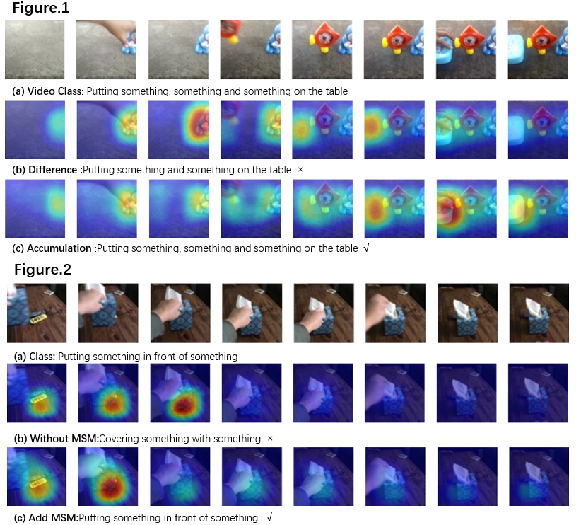

# MAS-Net for action recognition

## Overview
**[Nov 16, 2021]** Submitted in **CVPR 2022**.

**[Nov 16, 2021]** We have released the PyTorch code of **MAS-Net**.

## Dataset
In our paper, we conduct experiments on Something-Something V1&V2 and Kinetics-400. Please refer to [TSM](https://github.com/mit-han-lab/temporal-shift-module) for the detailed guide of data pre-processing.

## Training
Please refer to `scripts/train.sh`, more details can be found in the appendix of our paper.
- For example, to train MAS-ResNet50 on Something-Something-V1 with 4 gpus, you can run:
```
python main.py --lr 0.01 --epochs 70 --dataset_path ../../datasets/ --dataset somethingv1 \
                --arch resnet50 --num_segments 8 --store_name MAS_Net[v1_8] \
                --gpus 0 1 2 3 --workers 8 --batch-size 32 \
                --dropout 0.5 --weight_decay 5e-4 \
                --lr_type MAS_lr --lr_steps 30 40 50 60
```
## Testing
Please refer to `scripts/test.sh` and our paper for more datails.
- For center crop & single clip, you can run:
```
python test.py --dataset somethingv1 --weights ./your.pth.tar --test_segments 8 --test_crops 1 --batch_size 32 -j 8
```

- For 3 crops & 2 clips, you can run:
```
python test.py --dataset somethingv1 --weights ./your.pth.tar --test_segments 8 --test_crops 3 --batch_size 8 -j 8 --full_res --twice_sample
```    

- For 3 crops & 10 clips, you can run:
```
python test.py --dataset somethingv1 --weights ./your.pth.tar --test_segments 8 --test_crops 3 --batch_size 2 -j 8 --full_res --dense_sample --dense_sample_num 10
```   

- if you want to get the result of ensemble, you can run:
```
python average_scores.py
```    

## Results
### Something-Something: 
#### 1-Crop & Center-Clip
Model| Frames x 1Crop x 1Clip |V1-Top1 |V2-Top1| 
:--: | :--: | :--: | :--:| 
MAS-ResNet50_8F  | 8 x 1 x 1      | 49.2%  | 61.5%  
MAS-ResNet50_16F | 16 x 1 x 1     | 51.9%  | 63.0%  
MAS-ResNet50_EN  | (8+16) x 1 x 1 | 54.5%  | 65.1%  

#### 3-Crops & 2-Clips
Model| Frames x Crops x Clips |V1-Top1 |V2-Top1| 
:--: | :--: | :--: | :--:| 
MAS-ResNet50_8F  | 8 x 3 x 2      | 51.1%  | 63.9%  
MAS-ResNet50_16F | 16 x 3 x 2     | 53.4%  | 65.1%  
MAS-ResNet50_EN  | (8+16) x 3 x 2 | 55.4%  | 66.7%  

### Kinetics-400:
Model  | Frames x Crops x Clips   |&nbsp; Top-1 &nbsp;  | &nbsp;  Top-5  &nbsp;  |
:--: | :--: | :--: | :--:| 
MAS-ResNet50_16F    | 16 x 3 x 10 |&nbsp; 75.7%  |&nbsp; 92.6%  


## Visualization
We visualize the class activation maps with Grad-CAM，if you want to observe the visualization results，you can run：
```
python CAM.py
```
    


## Contact
657786844@qq.com

## Acknowledgements
We especially thank the contributors of the [TSN](https://github.com/yjxiong/tsn-pytorch) and [TSM](https://github.com/mit-han-lab/temporal-shift-module) codebase for providing helpful code.
