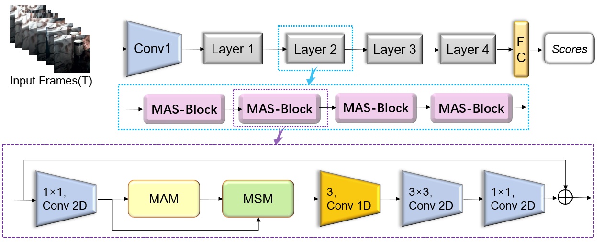
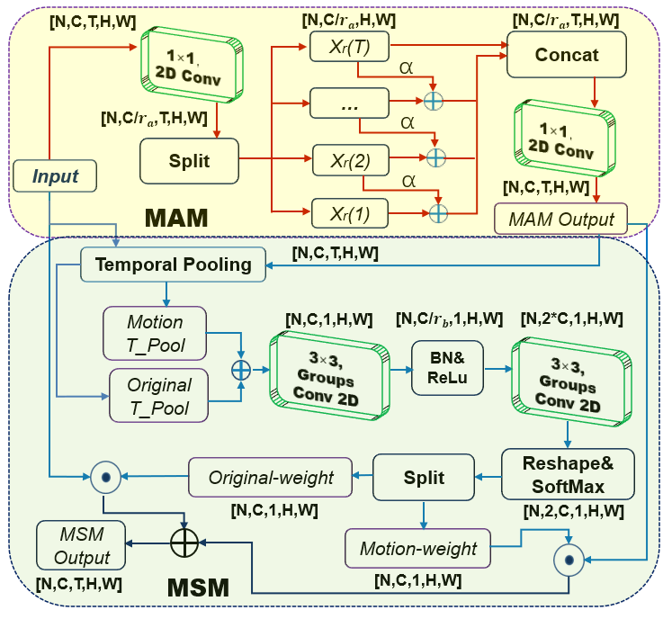
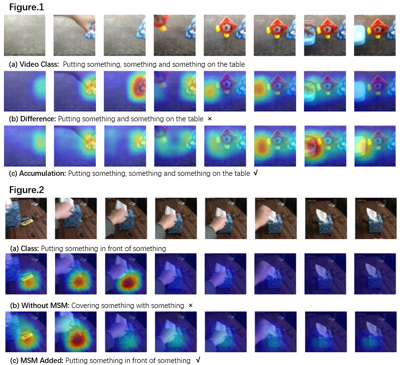

# MAS-Net for action recognition

We release the PyTorch code of the MAS-Net(Motion Accumulation and Selection Net). This code is based on the [TSN](https://github.com/yjxiong/tsn-pytorch) and [TSM](https://github.com/mit-han-lab/temporal-shift-module) codebase. The core code to implement the MAS-Net are `ops/MASNet.py`

**[Nov 16, 2021]** Submitted in **ECCV 2022**.

**[Nov 16, 2021]** We have released the PyTorch code of **MAS-Net**.

## Overview
#### MAS-Net: 


#### MAM & MSM: 


## Content
* [Prerequisites](#prerequisites)
* [Dataset](#dataset)
* [Training](#training)
* [Testing](#testing)  
* [Results](#results)  
  + [Something-Something](#something-something)
  + [Kinetics-400](#kinetics-400)
  + [Visualization](#visualization)
* [Other Info](#other-info)  
  - [Citation](#citation)
  - [References](#references)
  - [License](#license)
  - [Contact](#contact)
  
## Prerequisites
The code is built with following libraries:
- Python 3.6
- [PyTorch](https://pytorch.org/) 1.0 or higher
- [Torchvision](https://github.com/pytorch/vision)
- [TensorboardX](https://github.com/lanpa/tensorboardX)
- [tqdm](https://github.com/tqdm/tqdm.git)
- [scikit-learn](https://scikit-learn.org/stable/)


## Dataset
In our paper, we conduct experiments on Something-Something V1&V2 and Kinetics-400. Please refer to [TSM](https://github.com/mit-han-lab/temporal-shift-module) for the detailed guide of data pre-processing.

## Training
Please refer to `scripts/train.sh`, more details can be found in the appendix of our paper.
- For example, to train MAS-Net_8f basd on ResNet50 on Something-Something-V1 with 4 gpus, you can run:
```
python main.py --lr 0.01 --epochs 70 --dataset_path ../../datasets/ --dataset somethingv1 \
                --arch resnet50 --num_segments 8 --store_name MAS_Net[v1_8] \
                --gpus 0 1 2 3 --workers 8 --batch-size 32 \
                --dropout 0.5 --weight_decay 5e-4 \
                --lr_type MAS_lr --lr_steps 30 40 50 60
```
## Testing
Please refer to `scripts/test.sh` and our paper for more datails.
- For center crop & single clip, you can run:
```
python test.py --dataset somethingv1 --weights ./your.pth.tar --test_segments 8 --test_crops 1 --batch_size 32 -j 8
```

- For 3 crops & 2 clips, you can run:
```
python test.py --dataset somethingv1 --weights ./your.pth.tar --test_segments 8 --test_crops 3 --batch_size 8 -j 8 --full_res --twice_sample
```    

- For 3 crops & 10 clips, you can run:
```
python test.py --dataset somethingv1 --weights ./your.pth.tar --test_segments 8 --test_crops 3 --batch_size 2 -j 8 --full_res --dense_sample --dense_sample_num 10
```   

- if you want to get the result of ensemble, you can run:
```
python average_scores.py
```    

## Results
### Something-Something: 
#### 1-Crop & Center-Clip
Model| Frames x 1Crop x 1Clip |GFLOPs |V1-Top1 |V2-Top1 | checkpoint|
:--: | :--: | :--: | :--:| :--:| :--:
MAS-ResNet50_8F  | 8 x 1 x 1      | 34  | 49.2%  | 61.5%  | [V1 ](https://www.jianguoyun.com/p/DQaSlKoQquWCChj8j5wE)  &nbsp;  [V2](https://www.jianguoyun.com/p/Db3-nE8QquWCChiKkZwE)
MAS-ResNet50_16F | 16 x 1 x 1     | 67  | 51.9%  | 63.0%  | [V1 ](https://www.jianguoyun.com/p/DRTPIBIQquWCChiEkZwE)  &nbsp;  [V2](https://www.jianguoyun.com/p/DaYJfHcQquWCChiPkZwE)
MAS-ResNet50_EN  | (8+16) x 1 x 1 | 101 | 54.5%  | 65.1%  | [Ensemble](https://www.jianguoyun.com/p/DdMsVLMQquWCChiSkZwE)

#### 3-Crops & 2-Clips
Model| Frames x Crops x Clips |GFLOPs |V1-Top1 |V2-Top1| 
:--: | :--: | :--: | :--:|  :--:|
MAS-ResNet50_8F  | 8 x 3 x 2      | 34 x 6  | 51.1%  | 63.9%  
MAS-ResNet50_16F | 16 x 3 x 2     | 67 x 6  | 53.4%  | 65.1%  
MAS-ResNet50_EN  | (8+16) x 3 x 2 | 101 x 6 | 55.4%  | 66.7%  

### Kinetics-400:
Model  | Frames x Crops x Clips   |GFLOPs |&nbsp; Top-1 &nbsp;  | &nbsp;  Top-5  &nbsp;  |
:--: | :--: | :--: | :--:|  :--:|
MAS-ResNet50_16F    | 16 x 3 x 10 |  67 x 30  |75.7%  |92.6%  

### Visualization
We visualize the class activation maps with Grad-CAM，if you want to observe the visualization results，you can run：
```
python CAM.py
```
    


## Other Info
### Citation
None

### References
We especially thank the contributors of the [TSN](https://github.com/yjxiong/tsn-pytorch) and [TSM](https://github.com/mit-han-lab/temporal-shift-module) codebase for providing helpful code.

### License
None

### Contact
657786844@qq.com
